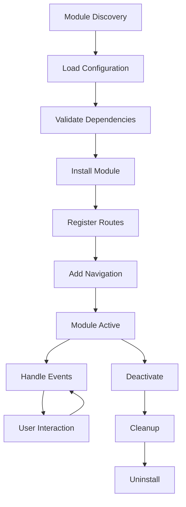
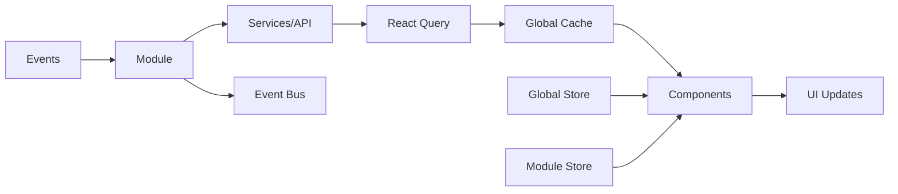

# OpenChoreo Module System Architecture

## Overview

The OpenChoreo module system provides a scalable, type-safe architecture for building and extending the developer portal with both first-party and third-party modules.

## Key Principles

1. **Flat Structure** - No unnecessary nesting, direct access to module contents
2. **Clear Public API** - Explicit exports in index.ts define module boundaries  
3. **Type Safety** - Full TypeScript support with exported types
4. **Lazy Loading** - Routes and heavy components load on-demand
5. **Perspective Aware** - Modules can target specific user perspectives
6. **Permission Based** - Fine-grained access control

## Module Anatomy

```
module/
├── index.ts         # Public API & module registration
├── module.config.ts # Configuration & metadata
├── components/      # Reusable UI components
├── pages/          # Full page components
├── routes/         # Route definitions (optional)
├── services/       # Business logic & API
├── hooks/          # Custom React hooks  
├── types/          # TypeScript definitions
├── stores/         # State management (optional)
├── utils/          # Helper functions
└── assets/         # Static resources
```

## Module Lifecycle



## Route System

### Route Registration
Modules declare routes that are dynamically registered with the main router:

```typescript
export const routes = {
  base: '/module-path',
  perspective: 'platform-engineering',
  definitions: [
    { path: '/', component: MainPage },
    { path: '/:id', component: DetailPage },
    { path: '/settings', component: SettingsPage }
  ]
}
```

### Route Loading Strategy
1. **Static Routes** - Loaded with module
2. **Lazy Routes** - Loaded on navigation
3. **Protected Routes** - Check permissions before loading
4. **Nested Routes** - Support complex hierarchies

## Data Flow



## Module Communication

### Direct Import (Public API)
```typescript
import { AnalyticsWidget } from '@/modules/analytics'
```

### Event System
```typescript
// Publisher
eventBus.emit('analytics:data-updated', data)

// Subscriber  
eventBus.on('analytics:data-updated', handleUpdate)
```

### Shared State
```typescript
// Access global state
const { currentProject } = useGlobalStore()

// Module state
const { metrics } = useModuleStore('analytics')
```

## Security Model

### Permission Levels
1. **Module Level** - Can module be loaded?
2. **Route Level** - Can user access route?
3. **Component Level** - Can component be rendered?
4. **Action Level** - Can user perform action?

### Permission Check Flow
```typescript
// Config declares required permissions
permissions: ['view:analytics', 'export:data']

// Runtime checks
if (hasPermission('view:analytics')) {
  return <AnalyticsDashboard />
}
```

## Performance Optimization

### Code Splitting
```typescript
// Lazy load heavy components
const HeavyChart = lazy(() => import('./components/HeavyChart'))
```

### Route-Based Splitting
```typescript
// Routes load their components on-demand
{ 
  path: '/analytics', 
  component: () => import('./pages/Analytics')
}
```

### Data Caching
```typescript
// React Query handles caching
useQuery({
  queryKey: ['analytics', filters],
  queryFn: fetchAnalytics,
  staleTime: 5 * 60 * 1000, // 5 minutes
})
```

## Third-Party Modules

### Access Pattern
Third-party modules access platform capabilities through `window.OpenChoreo`:

```typescript
const { React, UI, Icons, ReactQuery } = window.OpenChoreo
const { Button, Card } = UI
const { useQuery } = ReactQuery
```

### Security Sandbox
- Limited API access
- Permission-based capabilities
- No direct file system access
- Validated inputs/outputs

## Module Registry

### Registration Process
1. Load module configuration
2. Validate against schema
3. Check dependencies
4. Register with system
5. Initialize module

### Discovery Mechanisms
- File system scan (first-party)
- URL loading (third-party)
- NPM packages
- Module marketplace

## Development Workflow

### Creating a Module
```bash
# Generate module structure
npx create-module my-module

# Develop locally
cd modules/my-module
pnpm dev

# Test module
pnpm test

# Build for production
pnpm build
```

### Module Testing
- Unit tests for components
- Integration tests for services
- E2E tests for critical paths
- Performance benchmarks

## Deployment

### First-Party Modules
- Bundled with main application
- Tree-shaken in production
- Optimized with main build

### Third-Party Modules
- Separate bundles
- Loaded on-demand
- Cached by browser
- Version managed independently

## Monitoring & Analytics

### Module Metrics
- Load time
- Error rate
- Usage statistics
- Performance metrics

### Error Tracking
- Isolated error boundaries
- Module-specific logging
- Telemetry integration

## Future Enhancements

1. **Module Marketplace** - Discover and install community modules
2. **Visual Module Builder** - Drag-and-drop module creation
3. **Module Versioning** - Support multiple versions simultaneously
4. **Federation** - Share modules across micro-frontends
5. **AI-Assisted Development** - Generate modules from descriptions